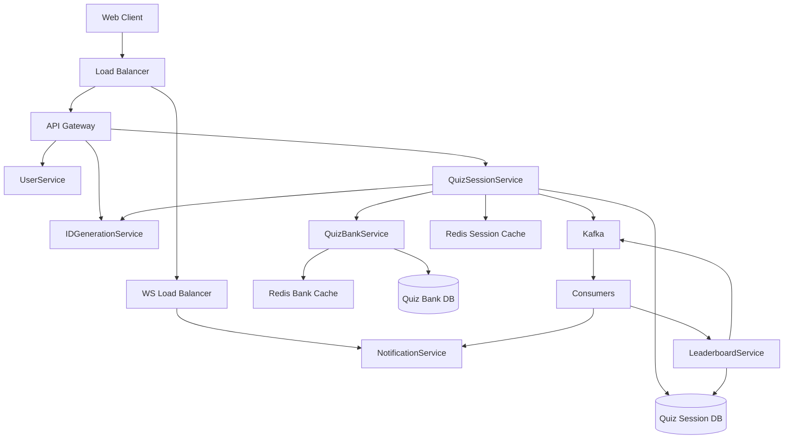
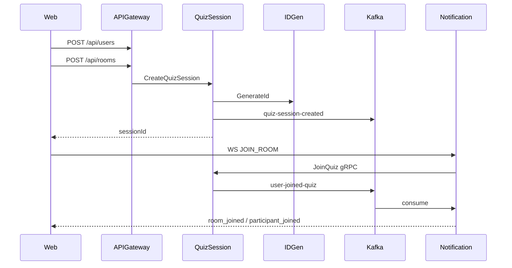
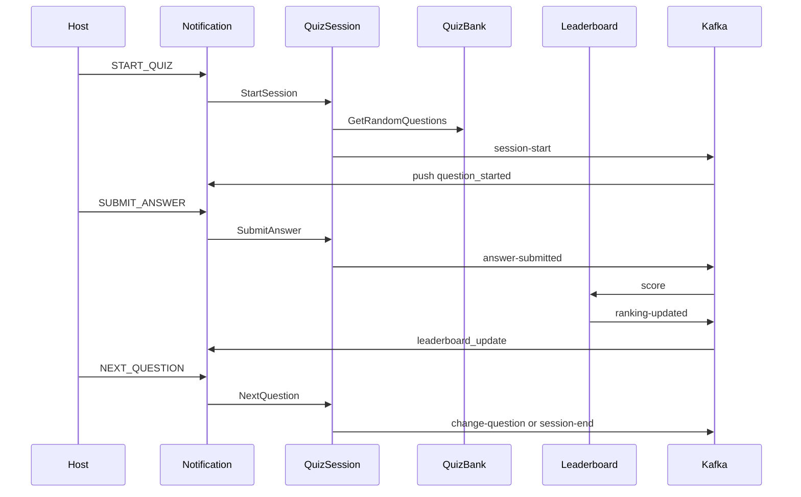

# Full Quiz Flow — Target Architecture Plan

Implement the full playable quiz flow against `Architecture.excalidraw`: extract QuizBank, Leaderboard, and Notification as separate services, use Kafka for event fan-out and Redis for session/bank cache, and wire the Next.js client end-to-end.

## Implementation checklist

- [x] **Phase A** — Redis/DB infra, topic constants, expanded protos/models, API Gateway skeleton, fix session ID generation on create
- [x] **Phase B** — QuizBankService + seed data; enrich QuizSession schema; create/join → Kafka → DB + Redis hydrate
- [x] **Phase C** — Extract NotificationService (owns WS); command→gRPC; Kafka→broadcast; Redis Pub/Sub; remove quiz-session in-memory WS
- [x] **Phase D** — Start/next/end runtime; LeaderboardService on answer-submitted; ranking-updated fan-out; answer dedupe
- [x] **Phase E** — UserContext, WS URL/rejoin, host controls, SUBMIT_ANSWER contract, timer/leaderboard/end UX
- [x] **Phase F** — Redis locks, reconnect, idempotent consumers, unified make run-all local stack

---

## Target design (from Architecture.excalidraw)

**Locked decisions**

- Full service split now (QuizBank, Leaderboard, Notification).
- Identity stays **name-only** (no auth/OAuth in this plan).
- Quiz content is **seeded** in QuizBank (no authoring UI yet).
- **Notification owns all WebSockets**; QuizSession/Leaderboard never push to clients directly.
- Live room state lives in **Redis** (not process memory) so WS can scale horizontally.
- Client talks REST to API Gateway; WS connects to Notification.

---

## Event contracts (Kafka topics)

Extend [`pkg/topics/quiz_session.go`](pkg/topics/quiz_session.go):

| Topic | Producer | Consumer(s) | Purpose |
|-------|----------|-------------|---------|
| `quiz-session-created` | QuizSession | Session-created → Session DB | Persist session |
| `user-joined-quiz` | QuizSession | User-joined → Session DB + Notification | Persist participant; push `participant_joined` |
| `session-start` | QuizSession | Notification (+ hydrate cache) | Broadcast first question |
| `change-question` | QuizSession | Notification | Broadcast next question |
| `session-end` | QuizSession | Notification + Leaderboard | Final leaderboard + finished state |
| `answer-submitted` | QuizSession (via prepare/runtime handler) | Leaderboard | Score answer |
| `ranking-updated` | Leaderboard | Notification | Push `leaderboard_update` |
| `quiz-completed` | Leaderboard/QuizSession | Session DB (optional) | Persist final scores |

Payloads stay JSON with stable fields: `sessionId`, `userId`, `name`, `question`, `questionIndex`, `participants[]`, `selectedOption`, `score`.

---

## Service responsibilities

### 1. API Gateway (new, thin Go edge)

- REST routes only: `/api/users`, `/api/rooms`, `/api/rooms/join`, `/api/rooms?id=`
- Proxies to User / QuizSession over gRPC (Consul discovery).
- CORS for `localhost:3000`; WS path is **not** terminated here (clients hit Notification `/ws`).
- Replaces the current HTTP surface in [`quiz-session-service/internal/handler/http/`](quiz-session-service/internal/handler/http/) as the public edge.

### 2. QuizBankService (new)

- gRPC: `GetRandomQuestions(count)`, `GetQuestionsByIds`
- Postgres `quiz_bank` + Redis bank cache
- Seed ~20–50 general-knowledge questions on migrate
- Called by QuizSession on **session start** (not create), matching the diagram’s “Start Quiz Session Flow”

### 3. QuizSessionService (refactor)

- Keep create/join/start/next/end domain logic; **remove embedded WS** from [`quiz-session-service/internal/gateway/socketio/server.go`](quiz-session-service/internal/gateway/socketio/server.go)
- Split handlers conceptually as in the diagram:
  - **Prepare**: create session (ID from IDGen), join (validate + Kafka)
  - **Runtime**: start (fetch questions from QuizBank → write Redis session state → `session-start`), change question, end
- HTTP create bug fix: stop using `hostId` as session ID; always use IDGeneration (align HTTP path with gRPC in [`quiz-session-service/internal/handler/http/room.go`](quiz-session-service/internal/handler/http/room.go) / service layer)
- Persist richer session model in Postgres: `host_id`, `status`, `question_ids` (JSON), `current_index`
- Redis session cache key `session:{id}`: host, status, participants map, questions (with correct answers server-side only), current index, answer set for current question

### 4. LeaderboardService (new)

- Consumes `answer-submitted`
- Validates option against cached/session question; increments score (time-bonus optional later)
- Writes ranking to Redis `leaderboard:{sessionId}` (sorted set) and raises `ranking-updated`
- On `session-end`, emits final ranking payload

### 5. NotificationService (new — owns WebSocket)

- Accepts WS connections; clients send `JOIN_ROOM`, `START_QUIZ`, `SUBMIT_ANSWER`, `NEXT_QUESTION`
- For commands: validate lightly, then **forward to QuizSession via gRPC** (or publish command topics); do not score locally
- Subscribes to Kafka (`user-joined-quiz`, `session-start`, `change-question`, `ranking-updated`, `session-end`) and broadcasts to room members
- Room membership: Redis `session:{id}:conns` + local conn map; use **Redis Pub/Sub** so any Notification instance can fan out when scaled
- First successful join sets host if unset; host leave reassigns via QuizSession gRPC

### 6. UserService + IDGeneration (existing)

- Persist users to Postgres (replace in-memory) so IDs survive restart
- Keep IDGeneration; improve later if needed (out of critical path)

---

## End-to-end flows

### Create + join

### Start → answer → next → end

---

## Frontend ([`web/`](web/))

Align client with new edge + contracts:

- Env-based REST (`NEXT_PUBLIC_API_URL`) and WS (`NEXT_PUBLIC_WS_URL`)
- Global `UserContext` from `localStorage` (`quizUser`); never hardcode `"current-user-id"`
- Quiz page: on mount, connect + `JOIN_ROOM` (supports refresh/direct link)
- Fix event handlers in [`web/app/contexts/WebSocketContext.tsx`](web/app/contexts/WebSocketContext.tsx): set `status: "in-progress"` on `question_started`; sync `currentQuestionIndex`; typed `participants[]`
- Fix `SUBMIT_ANSWER` payload: `{ roomId, answer: { selectedOption, questionId, timeToAnswer } }`
- Host UI: `hostId === currentUser.id`
- Timer: use `question.timeLimit`; auto-submit on timeout (including empty/no selection as skipped)
- Finished screen from `quiz_ended` / `session-end`

---

## Infra / local DX

- Add Redis + QuizBank Postgres to docker compose; document one `make start-infra` / `make run-all` that starts Consul, Kafka, Redis, DBs, all services, and consumers
- Shared topic constants in `pkg/topics`
- Shared Redis helpers in `pkg/cache/redis`
- Protos: `quizbank.proto`, expand `quizsession.proto` (Start/Join/Submit/Next), `leaderboard.proto` if needed for reads

---

## Implementation phases (execution order)

### Phase A — Foundations

- Docker Redis + quiz_bank DB; topic constants; Redis client package
- Expand protos/models for session status, participants, questions (public DTO without `correctAnswer` for clients)
- API Gateway skeleton + route existing user/room create through IDGen-fixed QuizSession

### Phase B — QuizBank + session persistence

- QuizBank service + seed migration
- Enrich QuizSession DB schema (`host_id`, `status`, `question_ids`, …)
- Create/join paths publish Kafka; consumers write DB; Redis hydrate on join

### Phase C — Notification extract

- Move WS from quiz-session into NotificationService
- Command → QuizSession gRPC; Kafka → broadcast
- Redis Pub/Sub for multi-instance fan-out
- Delete/replace in-memory `sync.Map` room logic in quiz-session

### Phase D — Runtime + Leaderboard

- Start: fetch questions, cache session, `session-start`
- Answer: `answer-submitted` → Leaderboard → `ranking-updated`
- Next/end: `change-question` / `session-end`
- Server-side answer dedupe per question; safe JSON number handling

### Phase E — Frontend full flow

- User context, WS rejoin, host controls, answer/timer/leaderboard/end UX
- Smoke-test script or checklist for 2-browser create/join/play

### Phase F — Hardening

- Room mutex / Redis locks for start/next
- Reconnect: same `userId` reattaches without duplicating participant
- Idempotent Kafka consumers; delivery ack on critical produces
- Collapse Makefile into reliable local stack

---

## Out of scope (explicit)

- OAuth / JWT auth
- Quiz authoring admin UI
- Real multi-region deploy / K8s manifests
- Time-bonus scoring sophistication beyond correct/incorrect (+ optional simple time factor later)
