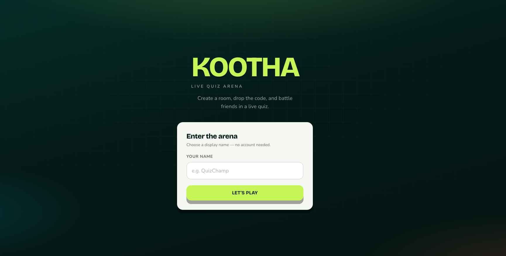
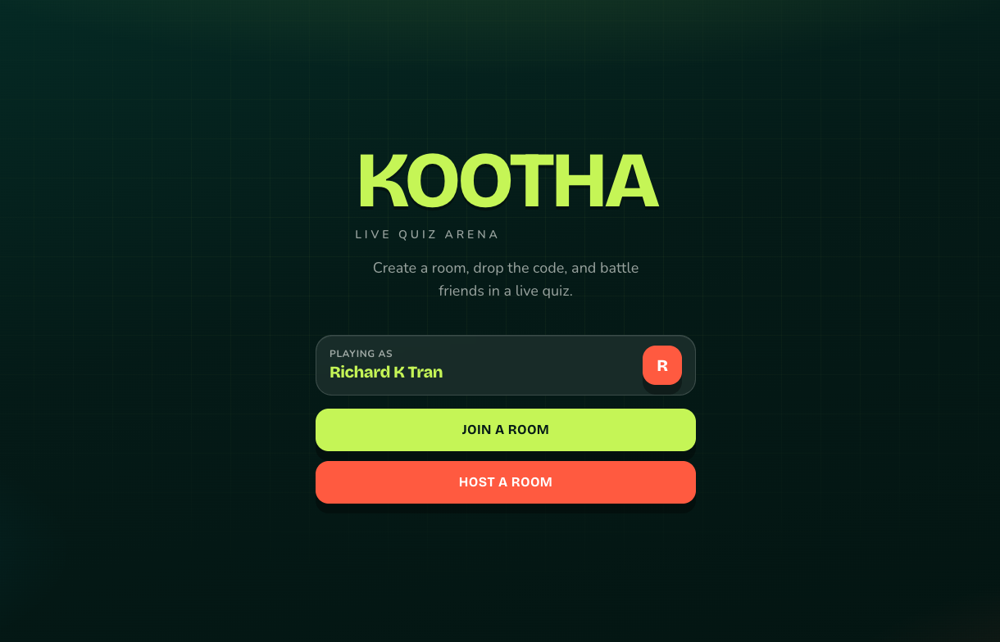
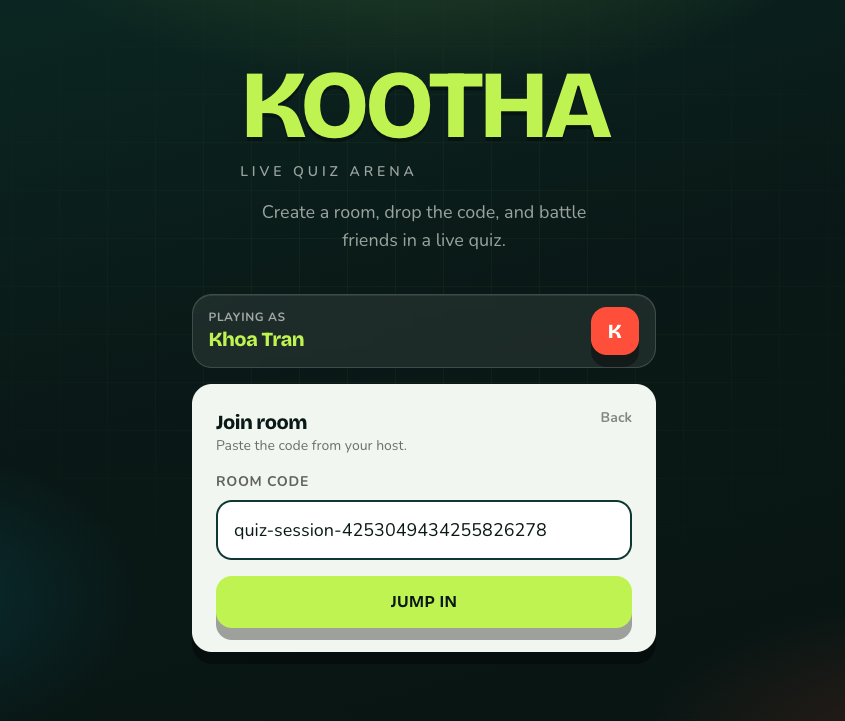
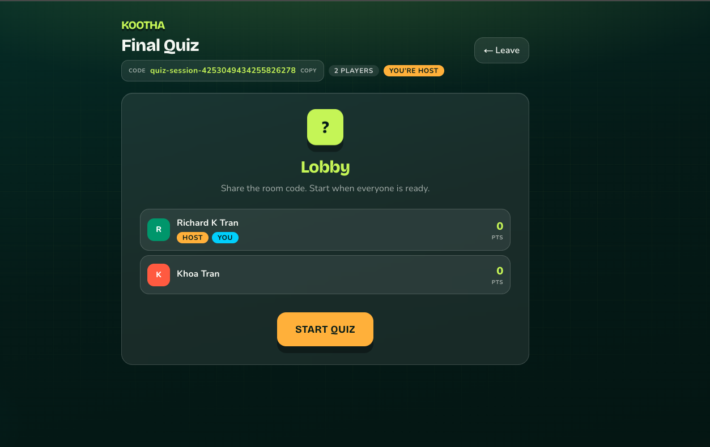
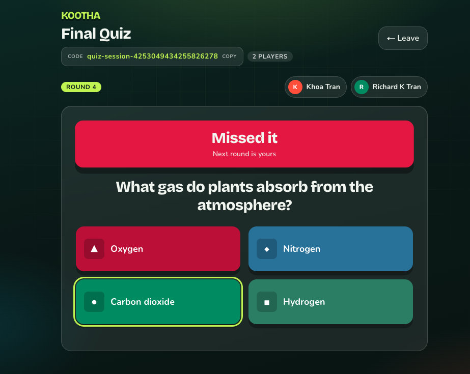
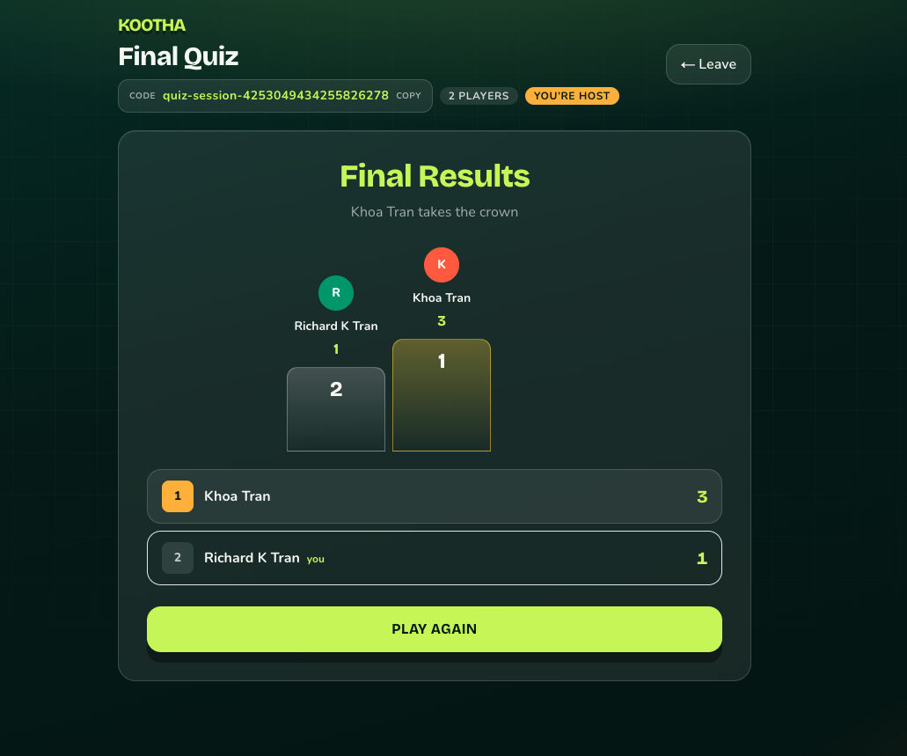
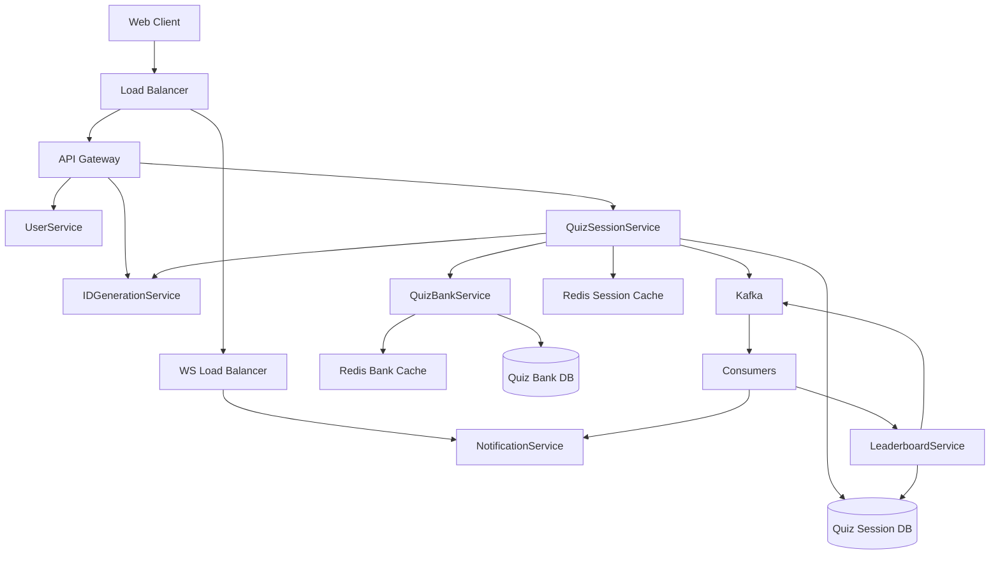

# Kootha

Realtime multiplayer quiz platform built as a Go microservice stack with a Next.js frontend.

Kootha is a **simple Kahoot-inspired clone** made for learning — a hands-on way to explore microservices, gRPC, Kafka, Redis, and WebSockets. It is not a production Kahoot replacement.

Players create or join rooms, answer questions in sync, and see live rankings over WebSockets.

<p align="center">
  
</p>

## Screenshots

| Enter name | Join or host |
|:---:|:---:|
|  |  |

| Join with code | Lobby |
|:---:|:---:|
|  |  |

| Live quiz | Final results |
|:---:|:---:|
|  |  |

## Architecture



| Component | Role |
|-----------|------|
| **api-gateway** | REST entrypoint for the web client |
| **user-service** | User identity |
| **id-generation-service** | Distributed ID generation |
| **quiz-bank-service** | Question bank |
| **quiz-session-service** | Rooms, sessions, gameplay orchestration |
| **notification-service** | WebSocket fan-out |
| **leaderboard-service** | Live rankings from answer events |
| **web** | Next.js client |

## Prerequisites

| Tool | Notes |
|------|--------|
| [Go](https://go.dev/dl/) 1.22+ | Backend |
| [Docker](https://docs.docker.com/get-docker/) | Redis, Postgres, Kafka, Consul |
| [migrate](https://github.com/golang-migrate/migrate) CLI | DB migrations (`migrate` on `PATH`) |
| [Bun](https://bun.sh/) (or Node/npm) | Frontend |
| `protoc`, `protoc-gen-go`, `protoc-gen-go-grpc` | Only needed to regenerate APIs |

## Quick start

```bash
# 1. Infrastructure (Consul, Redis, Postgres, Kafka) + migrations + all Go services
make start

# 2. Frontend (separate terminal)
make web-install   # first time only
make web
```

Open [http://localhost:3000](http://localhost:3000).

Stop Go services with `make stop`, or tear everything down (services + Docker) with `make down`.

```bash
make help    # list all targets
make status  # infra containers + listening ports
```

## Makefile targets

| Target | Description |
|--------|-------------|
| `make start` | Start infra, run migrations, run all Go services |
| `make stop` | Stop Go services (Docker infra keeps running) |
| `make down` | Stop services and tear down Docker infra |
| `make restart` | `stop` then `start` |
| `make infra-up` | Consul, Redis, Postgres, Kafka + topics |
| `make infra-down` | Stop Docker infrastructure |
| `make migrate` | Apply all database migrations |
| `make build` | Build binaries into `./bin` |
| `make run` | Run all Go services + Kafka consumers |
| `make web` | Start the Next.js dev server |
| `make protoc` | Regenerate gRPC stubs from `api/*.proto` |
| `make status` | Show container and port status |
| `make clean` | Stop services and remove build artifacts |

Run a single service: `make run-api-gateway`, `make run-quiz-session`, etc.

## Ports

| Service | Port |
|---------|------|
| Web | 3000 |
| API Gateway (REST) | 8080 |
| User (gRPC) | 8082 |
| ID Generation (gRPC) | 8083 |
| Quiz Session (gRPC) | 8084 |
| Quiz Bank (gRPC) | 8085 |
| Notification (WS) | 8086 |
| Redis | 6379 |
| Quiz Session Postgres | 5433 |
| Quiz Bank Postgres | 5434 |
| User Postgres | 5435 |
| Kafka | 9092 |
| Consul UI | 8500 |

## Project structure

```
.
├── api/                      # Protobuf definitions
├── api-gateway/              # REST gateway
├── id-generation-service/
├── user-service/
├── quiz-bank-service/
├── quiz-session-service/     # Session API + Kafka consumers
├── notification-service/
├── leaderboard-service/
├── pkg/                      # Shared libraries (Kafka, Consul, Redis, …)
├── docker/                   # Infra & Kafka Compose files
├── cmd/                      # Dev utilities (e.g. create-kafka-topics)
├── gen/                      # Generated protobuf / gRPC code
├── web/                      # Next.js frontend
└── Makefile
```

## Development

### Database migrations

```bash
make migrate

# New migration
make migrate-create name=add_foo service=quiz-session   # or quiz-bank
```

### Protobuf

After editing files under `api/`:

```bash
make protoc
```

### Build binaries

```bash
make build
# artifacts in ./bin/
```

## Smoke test

1. Open two browsers at [http://localhost:3000](http://localhost:3000).
2. Enter names → **Create room** in one → **Join** with the room ID in the other.
3. Host clicks **Start Quiz** → answer → host **Next Question** until finished.

## Contributing

1. Fork the repository and create a feature branch.
2. Keep changes focused; match existing Go and frontend style.
3. Run migrations and `make start` locally before opening a PR.
4. Open a pull request with a clear description of the change.

## License

See repository license files. The web app includes its own license under [`web/LICENSE`](web/LICENSE).
